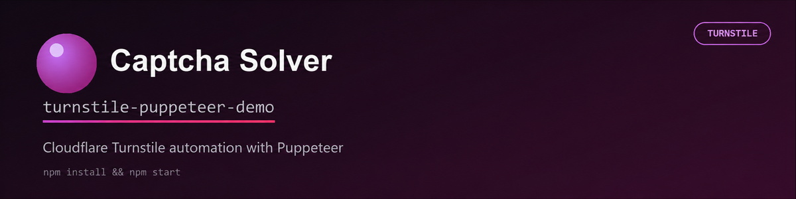

# Cloudflare Challenge Demo

## About

Puppeteer example for solving a Cloudflare Challenge page with the
[Captcha Solver JavaScript SDK](https://github.com/captcha-solver-api/javascript-sdk).

## Usage

Clone and install:

```bash
git clone https://github.com/captcha-solver-api/cloudflare-turnstile-puppeteer-demo.git
cd cloudflare-turnstile-puppeteer-demo
npm install
```

Set your Captcha Solver API key and the production page where Cloudflare
Challenge is displayed.

Linux and macOS:

```bash
export CAPTCHA_API_KEY=your_captcha_solver_api_key
export TARGET_URL=https://your-site.example/protected-page
npm start
```

Windows PowerShell:

```powershell
$env:CAPTCHA_API_KEY="your_captcha_solver_api_key"
$env:TARGET_URL="https://your-site.example/protected-page"
npm start
```

The script opens `TARGET_URL`, intercepts the Turnstile parameters and callback,
sends the task through Captcha Solver, and passes the returned token to the page.

## License

This project is licensed under the [MIT License](LICENSE).
